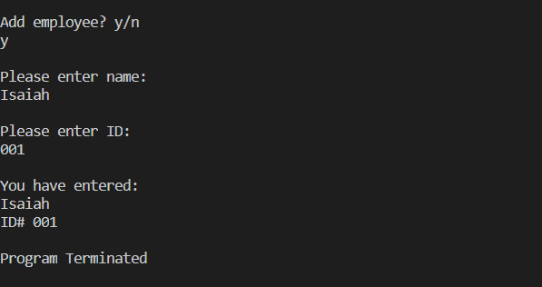

# Overview
This program has the capability to add basic employee information to a system. 

Not yet implemented:
* Lists
* Correcting entries
* Adding to database

# Development Environment
* Visual Studio Code  
* Java 14

# Execution
Download files into the same folder.
Execution of the program: `java manager.java`

# Useful Websites

1. [Java Reference](https://docs.oracle.com/en/java/)
2. [Java Tutorial](https://www.tutorialspoint.com/java/index.htm)